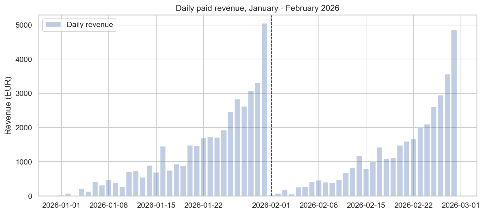
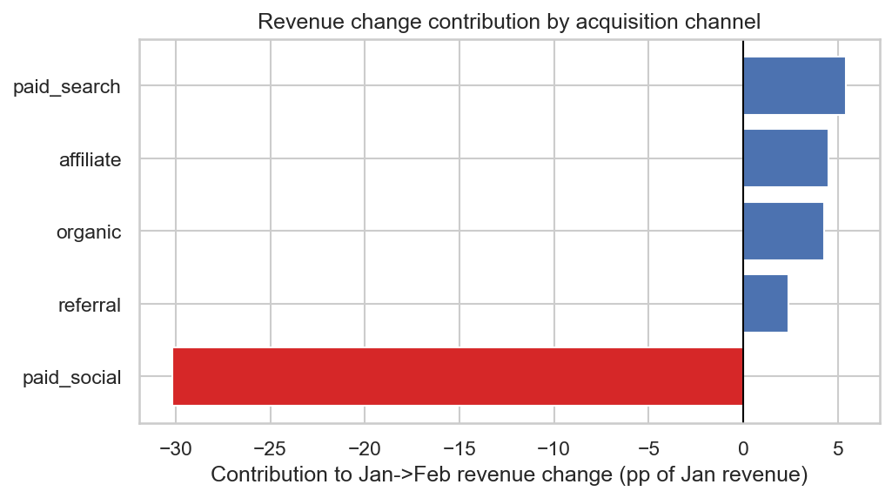
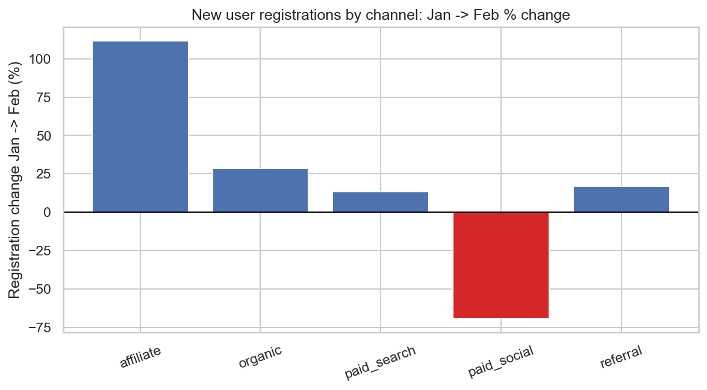
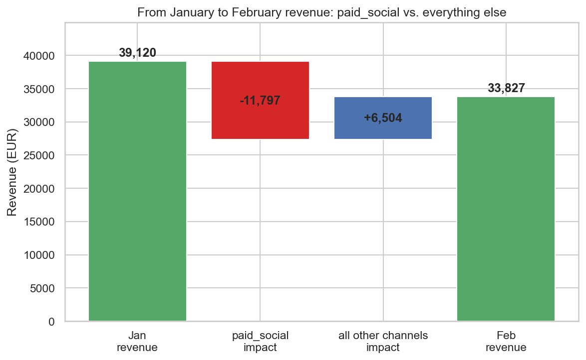

# eSIM Service - Why Did Revenue Drop in February 2026?

A data analytics case study built on a synthetic eSIM service dataset. The business question: revenue fell -13.5% month over month - why, and what should the team do about it?

This is a portfolio project. It's designed so you can get the full story just by scrolling through this page and the notebooks on GitHub - no need to clone the repo or run anything.

## TL;DR

- Revenue fell from 39,119.5 EUR (January) to 33,827.0 EUR (February) - -5,292.5 EUR (-13.5%).
- One root cause explains almost all of it: the **paid_social** acquisition channel lost 69% of its new user registrations in February.
- Because **paid_social** was a large (44% of Jan revenue) and premium-skewed channel, its collapse mechanically dragged down the blended average order value and *looked like* a broad shift away from expensive tariffs - it wasn't; every other channel actually grew.
- It's a top-of-funnel volume problem, not a conversion-quality problem: users who did register through **paid_social** converted to a paid order about as often as before.
- Calendar effects, refunds, country mix, platform mix, and repeat-purchase behavior were all checked and ruled out.

## The story in 4 charts

| | |
|---|---|
|  |  |
| 1. Revenue steps down, no single-day cliff - points to a structural change. | 2. **paid_social** is the outlier - every other channel grew in February. |
|  |  |
| 3. Registrations, not conversion, explain it - **paid_social** sign-ups collapsed -69%. | 4. The full picture: **paid_social** vs. everything else. |

## How the analysis is organized

This project follows the same structure an analyst would use on the job: check the data, decompose the headline number, chase down the real driver, and challenge your own first answer before presenting it.

1. [**notebooks/00_data_quality_and_overview.ipynb**](notebooks/00_data_quality_and_overview.ipynb) - is the data trustworthy, and what's the number we're explaining?
2. [**notebooks/01_revenue_drop_diagnosis.ipynb**](notebooks/01_revenue_drop_diagnosis.ipynb) - 9 hypotheses, from quick rule-outs (calendar, refunds, country, platform, repeat purchases) to the deep dive (orders vs. AOV, acquisition channel, tariff mix) and a confound check that ties the AOV story back to a single channel.
3. [**notebooks/02_cohort_conversion_analysis.ipynb**](notebooks/02_cohort_conversion_analysis.ipynb) - is **paid_social**'s problem about registration *volume* or onboarding *quality*? (Answer: volume.)
4. [**notebooks/03_conclusions_and_recommendations.ipynb**](notebooks/03_conclusions_and_recommendations.ipynb) - executive summary, hypothesis scorecard, limitations, and recommendations.

GitHub renders all four notebooks with their charts and tables directly in the browser - click any link above to read the full analysis.

## Why this matters (beyond the headline number)

The most useful finding here isn't "revenue fell 13.5%" - it's that two of the metrics that *looked* like independent causes (falling average order value, a shift away from expensive tariffs) turned out to be symptoms of a single upstream cause (one channel's acquisition volume collapsing), once tested directly by removing that channel from the data and re-running the same queries. Stopping at the first plausible-looking correlation would have pointed the business at the wrong fix (e.g. "promote cheaper plans less") instead of the real one ("find out why **paid_social** sign-ups dropped").

## Repository structure

******
esim-project-analytics/
├── data/
├── sql/
│   ├── 01_base_view.sql
│   ├── 02_data_quality_checks.sql
│   ├── 03_revenue_drop_hypotheses.sql
│   └── 04_cohort_conversion.sql
├── src/
│   └── db.py                    
├── notebooks/             
└── reports/figures/
******

## Tech stack

- Python (pandas, matplotlib, seaborn) for orchestration and visualization.
- SQL (DuckDB dialect, close to Postgres SQL) for every aggregation and hypothesis test - see [**sql/**](sql/).
- DuckDB as the query engine: it reads the CSVs directly, so there's no database server to install or configure.
- Jupyter notebooks to combine the SQL, the results, the charts, and the narrative in one reviewable document.

## Running it locally

No database setup needed - DuckDB runs in-process and loads the CSVs on the fly.

******bash
git clone <this-repo-url>
cd esim-project-analytics
pip install -r requirements.txt
jupyter notebook notebooks/00_data_quality_and_overview.ipynb
******

## Data

Two CSVs, ~26.9k users and ~3.6k orders, covering January-February 2026. Full data dictionary and known quirks: [**data/README.md**](data/README.md).

> The dataset is synthetic (generated for a take-home analytics exercise) and contains no real personal data, which is why it's committed to this repository in full instead of being gitignored.

## Scope note

This project focuses on the revenue-drop diagnosis and the cohort/conversion analysis. It does not cover the broader take-home exercise this dataset originally came from (cross-source data reconciliation, anomaly-detection agent design, etc.) - this repo is scoped specifically as a focused analytics case study.
